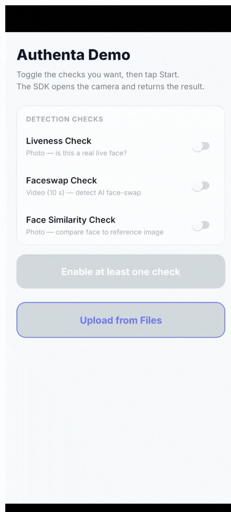

# Authenta SDK — Monorepo

This repository contains the Authenta eKYC SDK published as two independent npm packages.

| Package | npm | Description |
|---|---|---|
| [`@authenta/core`](./packages/core) | [](https://www.npmjs.com/package/@authenta/core) | Pure TypeScript API client — works in Node.js and React Native |
| [`@authenta/react-native`](./packages/react-native) | [](https://www.npmjs.com/package/@authenta/react-native) | React Native UI — camera capture modal powered by `@authenta/core` |

---

## Repository structure

```
authenta-reactnative-sdk/
├── packages/
│   ├── core/                  # @authenta/core
│   │   ├── src/
│   │   │   ├── client.ts      # AuthentaClient — upload, poll, result
│   │   │   ├── errors.ts      # Typed error classes
│   │   │   ├── types/         # All TypeScript interfaces
│   │   │   ├── utils/         # MIME helpers
│   │   │   └── index.ts       # Public API surface
│   │   ├── __tests__/         # Integration tests
│   │   ├── dist/              # Compiled output (git-ignored)
│   │   ├── package.json
│   │   └── tsconfig.json
│   │
│   └── react-native/          # @authenta/react-native
│       ├── src/
│       │   ├── AuthentaCapture.tsx  # Self-contained camera modal
│       │   └── index.ts             # Public API surface
│       ├── __mocks__/         # Jest mocks for RN modules
│       ├── dist/              # Compiled output (git-ignored)
│       ├── package.json
│       └── tsconfig.json
│
├── examples/
|    |- AuthentaDemo/              # Example React Native app
├── package.json               # Workspace root
└── .gitignore
```

---

## Contributing

See [CONTRIBUTING.md](./CONTRIBUTING.md) for setup, build, test, guidelines, and publish steps.

---

## Demo app

See [AuthentaDemo/](./examples/AuthentaDemo/) for a runnable React Native app that demonstrates the full integration.

<p align="center">
  
</p>

---

## License

MIT © Authenta
