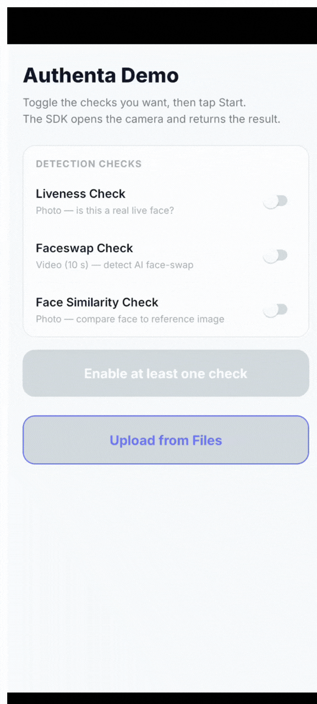

# Authenta SDK — Monorepo

This repository contains the Authenta eKYC SDK published as two independent npm packages.

| Package | npm | Description |
|---|---|---|
| [`@authenta/core`](./packages/core) | [](https://www.npmjs.com/package/@authenta/core) | Pure TypeScript API client — works in Node.js and React Native |
| [`@authenta/react-native`](./packages/react-native) | [](https://www.npmjs.com/package/@authenta/react-native) | React Native camera capture modal powered by `@authenta/core` |

---

## Which package should I use?

| Scenario | Package |
|---|---|
| React Native app — want a ready-made camera UI | `@authenta/react-native` |
| React Native app — have your own camera UI | `@authenta/core` |
| Node.js backend / script | `@authenta/core` |

---

## API overview

### Client setup (both packages)

```ts
import { AuthentaClient } from '@authenta/core'; // or '@authenta/react-native'

const client = new AuthentaClient({
  api_key:      'YOUR_API_KEY',
  auth_enabled: true,
  baseUrl:      'https://platform.authenta.ai', // optional
});
```

---

### `@authenta/core` — AuthentaClient methods

#### High-level

| Method | Description |
|---|---|
| `uploadAndPoll(uri, model, options?)` | Upload → finalize → poll → result in one call. Returns `ProcessedMedia` (or `CreateMediaResponse` when `autoPolling: false`) |
| `verify_liveness(uri)` | FI-1 liveness — returns `DetectionResult` with `isSpoof` |
| `verify_deepfake(uri)` | FI-1 faceswap — video only, returns `DetectionResult` with `isDeepFake` |
| `verify_similarity(uri, referenceUri)` | FI-1 face similarity — returns `DetectionResult` with `isSimilar` + `similarityScore` |
| `verify_face_embeddings(uri)` | FE-1 face vector — returns `DetectionResult` with `faceVector` |

#### Low-level (step by step)

| Method | Description |
|---|---|
| `upload(uri, model, options?)` | Create a job, resolve file info, upload to S3. Returns `CreateMediaResponse` |
| `finalizeMedia(jobId)` | Signal the server that all files are uploaded — job moves to "queued" |
| `pollResult(jobId, options?)` | Poll `GET /jobs/{id}` until terminal status. Returns `ProcessedMedia` |
| `getResult(media)` | Download the result JSON from the S3 artifact. Returns `DetectionResult` |

#### CRUD

| Method | Description |
|---|---|
| `createMedia(params)` | Create a raw job record. Returns `CreateMediaResponse` |
| `getMedia(jobId)` | Fetch a single job. Returns `ProcessedMedia` |
| `listMedia(params?)` | List jobs with pagination. Returns `ListMediaResponse` |
| `deleteMedia(jobId)` | Delete a job |
| `get_task_id(modelType)` | Resolve model type string to task type ID |

---

### `@authenta/react-native` — AuthentaCapture component

```tsx
import { AuthentaCapture } from '@authenta/react-native';

<AuthentaCapture
  client={client}
  modelType="FI-1"
  visible={captureOpen}
  livenessCheck={true}
  faceswapCheck={false}
  faceSimilarityCheck={false}
  onClose={() => setCaptureOpen(false)}
  onResult={(media) => {
    console.log(media.result?.isSpoof);
    console.log(media.result?.isDeepFake);
    console.log(media.result?.isSimilar);
  }}
  onError={(err) => console.error(err.message)}
/>
```

The component handles: camera permission requests, VisionCamera, photo/video capture, reference image picker, S3 upload, polling, result display, and up to 3 retry attempts — all without any code in your app beyond the props above.

**Peer dependencies required:**

```bash
npm install react-native-vision-camera react-native-image-picker \
  react-native-blob-util react-native-compressor \
  react-native-nitro-modules react-native-nitro-image
```

---

## Flow diagram

```
uploadAndPoll() — what happens internally
─────────────────────────────────────────
1. upload()
   ├── resolveUri()        read file from device
   ├── createMedia()       POST /api/v1/jobs  →  job.id + signed S3 URLs
   └── uploadToS3()        PUT file(s) to signed URL(s)

2. finalizeMedia()         POST /api/v1/jobs/{id}/finalize  →  status: "queued"

3. pollResult()            GET /api/v1/jobs/{id}  (repeat until "completed")

4. getResult()             GET signed S3 artifact URL  →  DetectionResult JSON
```

---

## Repository structure

```
authenta-reactnative-sdk/
├── packages/
│   ├── core/                        @authenta/core
│   │   ├── src/
│   │   │   ├── client.ts            AuthentaClient
│   │   │   ├── errors.ts            Typed error classes
│   │   │   ├── types/index.ts       All TypeScript interfaces
│   │   │   └── utils/helpers.ts     MIME type helpers
│   │   └── __tests__/               Integration tests (run against live API)
│   │       ├── setup.ts             Shared client + file paths
│   │       ├── fi1-liveness.test.ts
│   │       ├── fi1-faceswap.test.ts
│   │       ├── fi1-similarity.test.ts
│   │       ├── fi1-full.test.ts
│   │       ├── df1.test.ts
│   │       ├── ac1.test.ts
│   │       ├── verify-helpers.test.ts
│   │       └── media-crud.test.ts
│   │
│   └── react-native/                @authenta/react-native
│       ├── src/
│       │   ├── AuthentaCapture.tsx  Self-contained camera modal
│       │   └── index.ts             Re-exports core + AuthentaCapture
│       └── package.json
│
├── examples/
│   ├── core/                        Runnable ts-node examples
│   │   ├── 01-liveness-check.ts
│   │   ├── 02-faceswap-check.ts
│   │   ├── 03-face-similarity-check.ts
│   │   ├── 04-face-embeddings.ts
│   │   └── tsconfig.json
│   └── AuthentaDemo/                Full React Native demo app
│       └── App.tsx
└── README.md
```

---

## Running the integration tests

Edit `packages/core/__tests__/setup.ts` to set your API key and local file paths, then:

```bash
cd packages/core

# Run all tests
npx jest

# Run one scenario at a time
npx jest --testPathPattern=fi1-liveness
npx jest --testPathPattern=fi1-faceswap
npx jest --testPathPattern=fi1-similarity
npx jest --testPathPattern=fi1-full
npx jest --testPathPattern=df1
npx jest --testPathPattern=ac1
npx jest --testPathPattern=verify-helpers
npx jest --testPathPattern=media-crud
```

---

## Running the core examples

```bash
cd examples/core
npx ts-node 01-liveness-check.ts
npx ts-node 02-faceswap-check.ts
npx ts-node 03-face-similarity-check.ts
npx ts-node 04-face-embeddings.ts
```

---

## Demo app

See [examples/AuthentaDemo/](./examples/AuthentaDemo/) for a runnable React Native app.

<p align="center">
  
</p>

---

## License

MIT © Authenta
